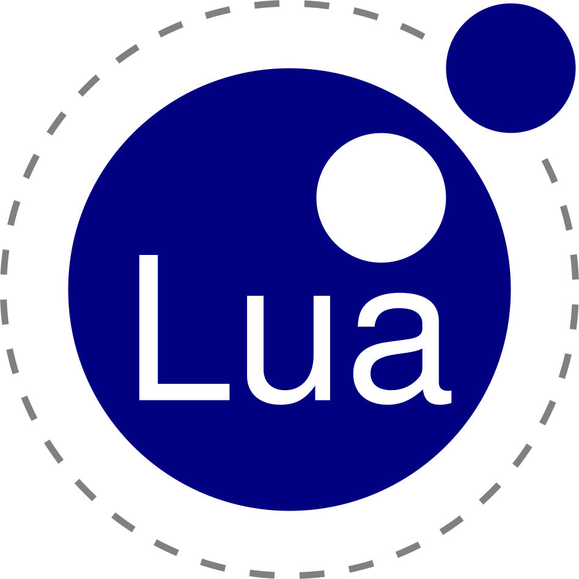
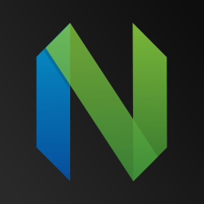
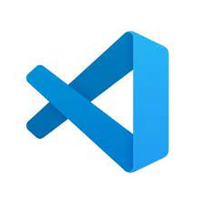

### Hi there 👋
> 14 years old

> Dutch :netherlands:

### Programming languages that I am capable of
<table>

<tr>

<td>
<h4> Python</h4>

</td>
<td>
<h4> C lang </h4>

</td>

<td>
<h4>lua</h4>

</td>

<td>
<h4>Rust</h4>

</td>

</tr>

</table>

### Tools that I use
<table>

<tr>

<td>
<h4>
<a href="https://neovim.io/">Neovim</a>
</h4>

</td>
<td>
<h4>
<a href="https://code.visualstudio.com/">
Visual Studio Code
</a>
</h4>

</td>
<td>
<h4>
<a href="https://www.jetbrains.com/pycharm/">PyCharm</a>
</h4>

</td>
<td>
<h4>
<a href="https://www.jetbrains.com/rust/">RustRover</a>
</h4>

</td>
</tr>
</table>

<a href="https://portfolioluxkatana.mlserv.xyz/">Even more smaller about me</a>
